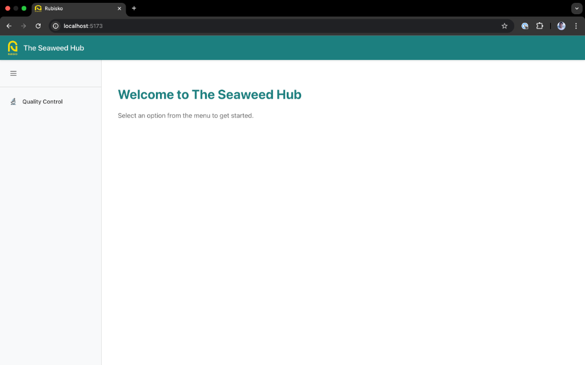
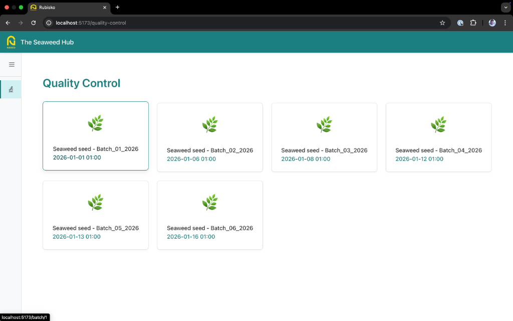
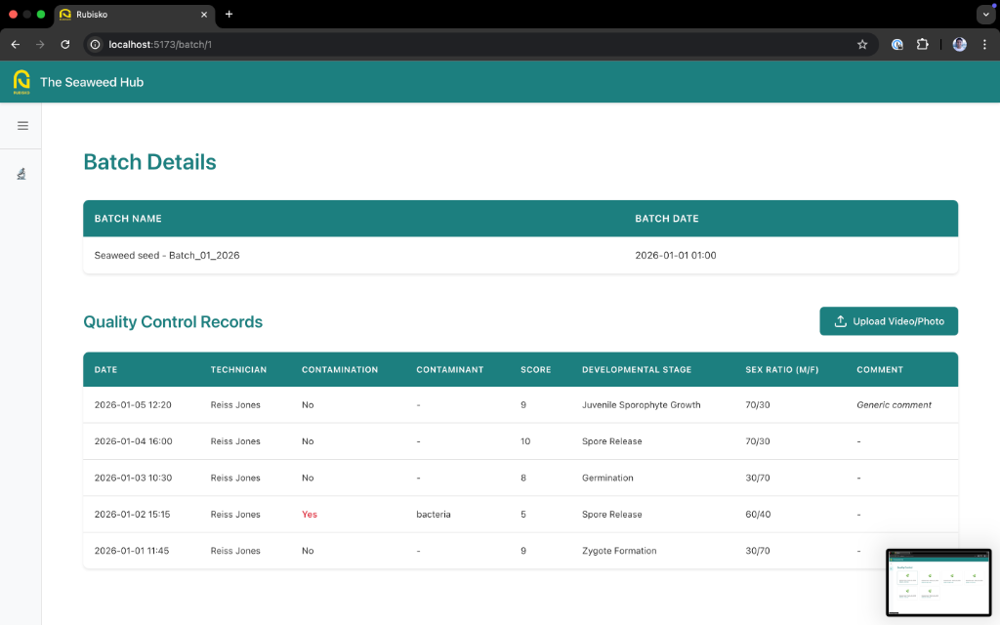
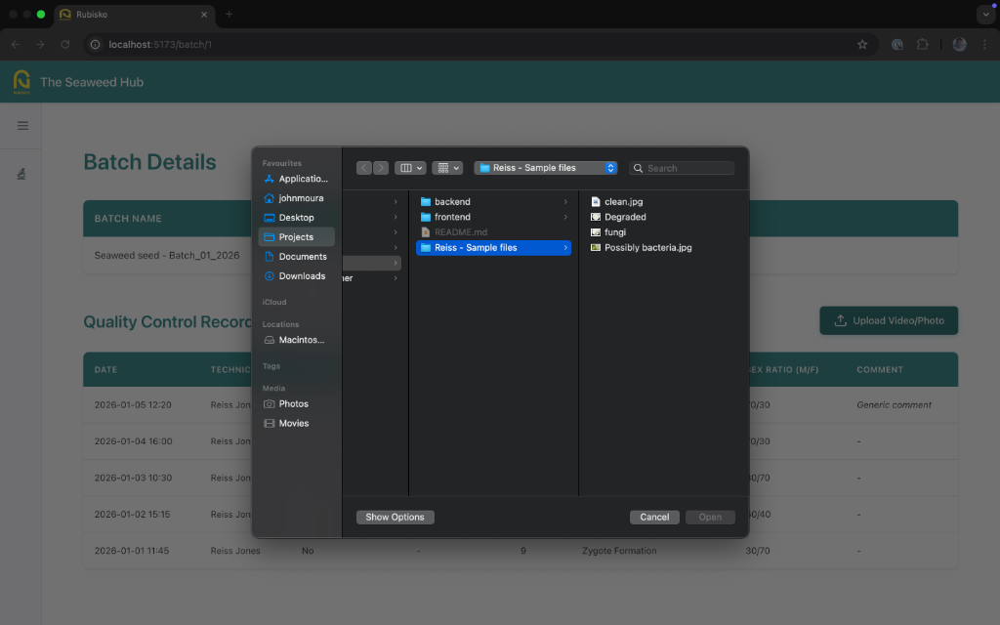
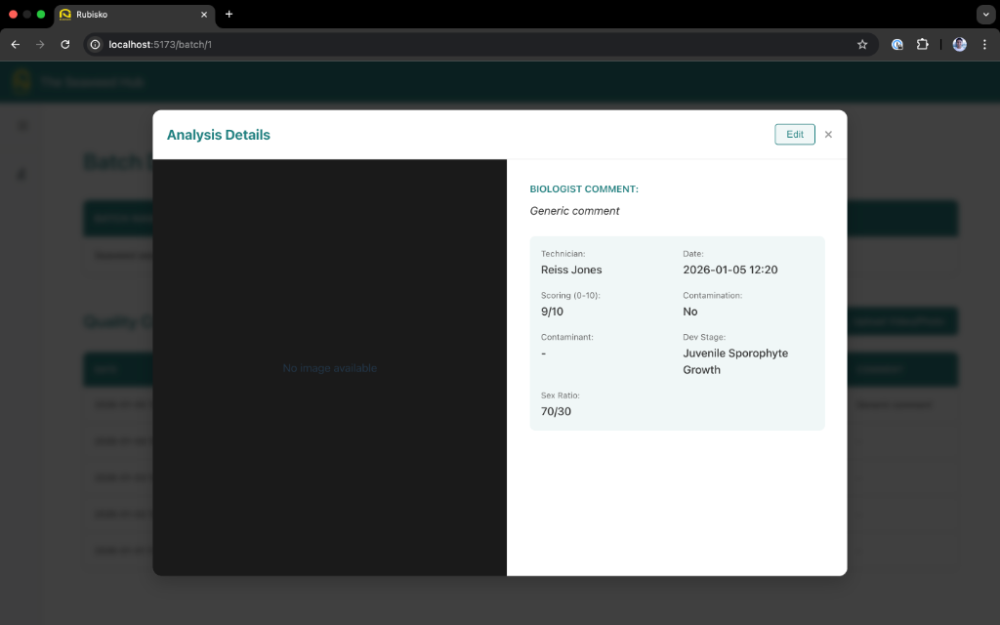

# Rubisko - Seaweed Quality Control

A full-stack application for seaweed quality control analysis, using React (Frontend), Flask (Backend), and Google Gemini (AI).

## Application Preview







## Prerequisites

- **SQLite**: Required for local data persistence.
- **Google Gemini API Key**: Obtain one from [Google AI Studio](https://aistudio.google.com/).

## Quick Start

### 1. Backend Setup
```bash
cd backend
python3 -m venv venv
source venv/bin/activate  # Windows: venv\Scripts\activate
pip install -r requirements.txt

# Configure environment
cp .env.example .env
# Edit .env and add your GEMINI_API_KEY

# Initialize database
python seed_db.py

# Start server
python app.py
```
Backend runs on [http://localhost:5001](http://localhost:5001).

### 2. Frontend Setup
```bash
cd frontend
npm install
npm run dev
```
Frontend runs on [http://localhost:5173](http://localhost:5173).

## Running the App
1.  Ensure the backend is running (`python app.py`).
2.  Ensure the frontend is running (`npm run dev`).
3.  Open your browser to [http://localhost:5173](http://localhost:5173).
